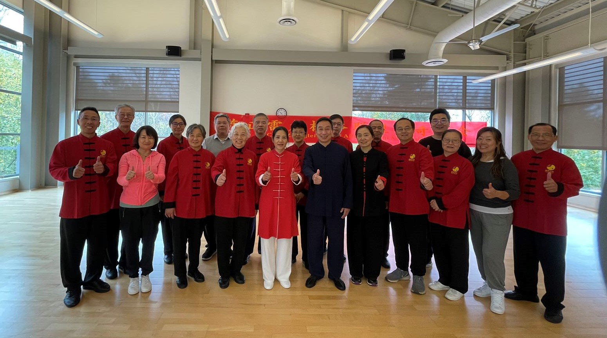

# 【太极拳传承班】

太极拳来源于中国，属于全人类。太极拳是中国优秀传统文化瑰宝，2020年12月入选人类非物质文化遗产名录，已成为一项世界性的运动，全世界已有150多个国家，近4亿人在练太极拳，深受全世界人民的喜爱。中华传统太极拳是基于人体生命科学基础，以功法修练和文化修养为一体，通过调节意念，肢体，呼吸等方式，融合导引学，心理学，康复学，中医养生学等相关知识，通过调动人体自主调节和自愈功能，激发自我潜能，促进身心健康的一项完美运动。

能给人们带来身心双修作用的是指中华传统太极拳，中国认可的传统太极拳有六大流派：陈式，杨式，武式，吴式，孙式，和式。这几大流派都直接或间接来源于陈式。

目前太极拳有四种形式在民间流传：

- 一是正宗正源的传统太极拳。
- 二是中国体育管理部门和高等院校在杨式太极拳基本上创编的“简化套路”，用于全民推广，应叫“太极操”。还有一种竞赛套路，主要用于参加比赛。
- 三是民间人士根据太极拳改编的娱乐项目叫“太极舞”。
- 四是根据江湖传说和武侠小说及“受攀仙附道”而来的“神仙太极拳”。

中国国家权威认证：传统太极拳发源于河南温县陈家沟，创始人陈王庭。目前国家认可的杨，武，吴，孙，和。都是直接或间接源于此。太极拳好，练传统太极拳可以让你性命双修，这是有科学依据和实践证明的，美国已把太极拳做为预防和康复运动处方，哈费医学院已把传统太极拳引入临床医疗。

江湖上的“太极操”，“太极舞”，“神仙拳”。给您不但带不来性命双修的效果，而且还会给你生理和心理带来伤害，如闫芳，马保国，雷雷之流的太极拳表演。

辦别正宗正源太极拳传人你可从两个方面去查：

- 一是到国家武协权威资质武术段位认证官网查询他（拳种，段位高低都显示）。
- 二是看他师承于谁。是不是传统太极拳传承人。

看了如上述说，你想学真功夫，是不是还要费点小功夫来甄别呢？习拳易，习好拳不易，在美国寻名师难，遇名师引路更不易，机会不要错过，陈式太极拳（一年期）传承班将于11月6日正式开启。该班为小班授课（限25人），由陈式太极拳十二代传承人，世界太极拳名师陈正雷大师优秀入室弟子，中国武术七段谢宗奇老师亲自执教，传授正宗正源的陈式太极拳。

## 学习内容

陈式传统太极拳老架一路74式。

老架一路又称功夫架，是陈式太极拳最基本的套路，打好老架一路对习练者去僵求柔，养足内劲，培养扎实基本功，以及其他套路，器械的学习都是起着重要的基础作用。老架一路也是陈式太极拳的入门贴，是寻师问友，拜师学艺的必经之路。

主要学习内容分三大部分：

### (一) 太极拳理论学习

- 1，陈式太极拳的起源和传承
- 2，陈式太极拳的六大特性
- 3，陈式太极拳门规戒律
- 4，陈式太极拳礼仪礼节
- 5，陈式太极拳功法特点
- 6，陈式太极拳运动规律
- 7，如何练好陈式太极拳
- 8，陈式太极拳的练习步骤与方法

### (二) 基本功法学习

- 1，陈式太极拳对人体各部位的要求。
- 2，陈式太极拳手型和步型。
- 3，陈式太极拳抻筋拔骨术。
- 4，陈式太极拳六种缠丝法。
- 5，陈式太极拳桩功练习。
- 6，陈式太极拳采气功。
- 7，陈式太极拳抓气功。
- 8，陈式太极拳步法练习。
- 9，陈式太极拳腿法练习。
- 10，陈式太极拳放松功法训练。
- 11，陈式太极拳推手单手挽花。
- 12，陈式太极拳推手双手挽花。

### (三) 陈式太极拳套路学习

陈式太极拳老架一路学习。老架是陈家沟陈氏十四世祖陈长兴所创，其风格特点是：拳架舒展大方，步法轻灵稳健，身法中正自然，内劲统领会身，以缠丝劲为核心，动作以腰为轴，节节贯串，一动则周身无有不动，一静百骸皆静。运动如行云流水，绵绵不断，发劲时松活弹抖，完整一气。学员通过一年课程的系统学习，可熟练套路动作，知道运行规律。

总费用：4600＄（拳传有缘人，对我赴美后支持和帮助过的第一期德奇培训班学员，感谢你们的信任，才让我有勇气坚持下来。我郑重承诺，你们和你们的家人将终身享受特殊优惠价（此价格不对外发布，请谅解），以表感谢和回馈！）

中国各地同质课程，同资质教练收费：

- 北京正雷书院49800元人民币
- 河南省东武研修院39800元
- 深圳市德奇会馆39800元）

## 开课时间地点

2022年11月6日——2023年11月5日（学期一年）

**课时安排：**

- 全年不少于400小时的学习训练时间。
- 每周日安排两个小时的新课学习时间。
- 每周六安排两个小时拳理学习和纠错指导。
- 每周二至周五早上6.40一8.10点领练复习＋纠正指导

**上课地点：** 

- 罗杰卡特社区健身中心（Roger Carter Community Center）

**晨练地点：**  

- 雪松巷公园东区篮球场
- 山河中学蓝球场

**陈正雷太极拳德奇总会**

*2022年11月6日*