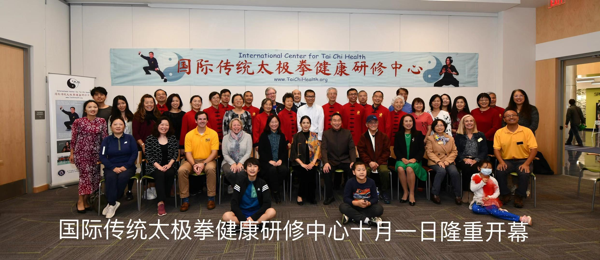

# 【首页】

国际传统太极拳健康研修中心（International Center for Tai Chi Health）2022年10月1日在美国马里兰州正式成立并举行开业典礼！

## 出席盛会的政府官员包括：

- 美国马里兰哈维郡郡长 Calvin Ball 博士
- 美国马里兰哈维教育局理事 陆昀 博士
- 美国马里兰哈维教育局理事 伍超 博士
- 美国马里兰哈维郡四区理事 Deb Jung
- 美国马里兰哈维郡前郡长 Allan Kittleman 的团队代表

## 送来贺电的武术界名人包括：

- 陈正雷大师，陈式太极拳十一代嫡系传承人，中国十大武术名师，中国武术九段，国家武术研究院专家委员会专家
- 张耀庭，原中国武协主席
- 田新得，中国武术协会副主席，广东武术协会主席
- 崔众三，杨氏太极拳传承人
- 张全亮，吴式太极拳传承人
- 张茂清，孙氏武学传人
- 和有禄，和式太极拳传承人
- 翟维传，武式太极拳传承
- 张东武，太极拳传承人，东武研究院院长
- 陈斌，中国河南省太极拳协会主席，陈式太极拳十二代嫡系传承人
- 赵国华，《少林与太极》主编
- 余功保，世界太极网创办人
