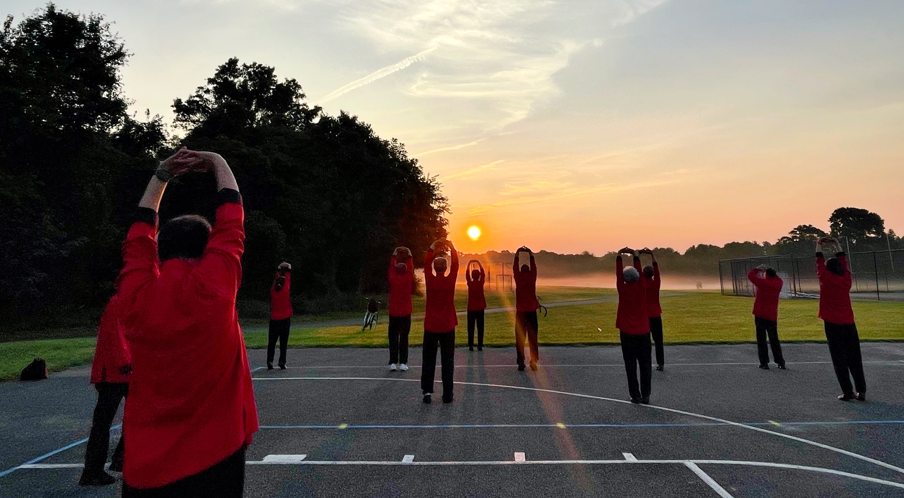

# 【Tai Chi for Everyone】

The Center offer free public classes year-around under the "Tai Chi for Everyone" campaign and includes the following free classes:

## 1. Free public Tai Chi promotion activities across Maryland

Maryland is vast with 24 counties. We will focus on the following six counties adjacent to Howard County - Baltimore, Montgomery, Anne Arundel, Prince George, Frederick, and Carroll County. We will work with local governments and non-profit organizations to establish proper venues. 

Stay tuned for more details to come.

## 2. Free public Tai Chi regular training in Howard County

The location of the regular training will be in senior centers, fitness centers, libraries, public parks, or any organization that is interested in hosting the classes. 

More details to come.

## 3. Free public Tai Chi year-long training in Howard County

The free classes started in November 2022 and are ongoing.

The locations are as follows:

- River Hill High School Basketball Court

> **Address:** 12101 Clarksville Pike, Clarksville, MD 21029  
> **Time:** Every Saturday and Sunday, from 7:00 a.m. to 9:00 a.m.

- Cedar Lane Park East Basketball Court

> **Address:** 10745 Route 108 (East) Columbia, MD 21044    
> **Time:** Every Monday through Friday, from 6:40 am to 8:30 am
