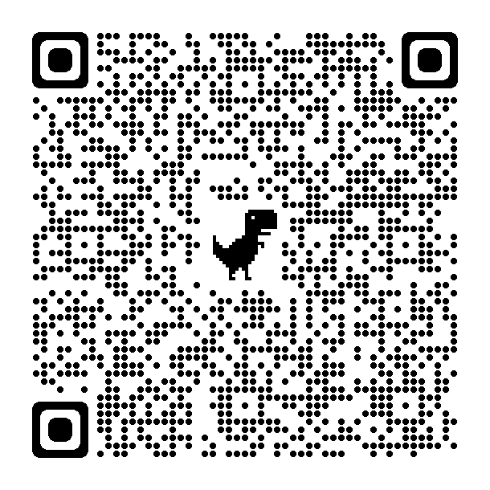

# 【Tai Chi Classes】

We offer different levels of training year-round as well as custom-tailored training for individuals and groups.
The following classes are offered at various Howard County Recreation & Parks facilities:

**Roger Carter Community Center**

**Cedar Lane Park Activity Room**

For details and to enroll, go to this [web site](https://anc.apm.activecommunities.com/howardcounty/activity/search?onlineSiteId=0&activity_select_param=2&activity_keyword=Traditional%20Chen-Style%20Tai%20Chi%20&viewMode=list).

Alternatively, you can scan this QR code: 

