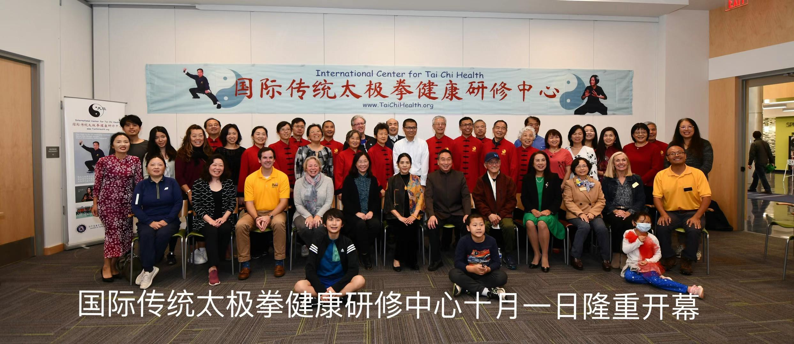

# 【Home】

**International Center for Tai Chi Health (ICTCH) Offers Free Tai Chi Classes to the Public** 

Research performed by the world's top medical institutions for many years have shown that traditional Taijiquan (commonly 
referred as Tai Chi) fares better at preventing and treating chronic diseases than modern medicines. 
Three hundred million people worldwide practice Tai Chi and their positive experiences are true testaments 
to the healing power of Taijiquan.

Tai Chi helps to regulate the flow of blood and Qi (vital energy), open up and align the meridians of the body, and 
has therapeutic effects on the mind, body, and soul.  No wonder Tai Chi is the most popular and effective 
form of exercise for prevention and healing of disease and nourishing of life.

If you have never been exposed to Tai Chi, don't worry, don't hesitate, and get ready.

The founding director of the International Center for Tai Chi Health， Master Zongqi Xie is a 12th generation descendant of 
Chen Style Taijiquan and an in-chamber disciple of Grandmaster Zhenglei Chen. Master Xie is a 7th Duan of Chinese martial arts 
and serves as a first-class national referee for Chinese martial arts. Master Xie has immigrated to the US and settled 
in Howard County, Maryland via a talent acquisition program in April 2022. Master Xie has a passion to help improve 
the health of people in communities across the county and the state using his sought-after Tai Chi know-how from 
decades of practice and teaching. 

To that end, Master Xie founded the International Center for Tai Chi Health (ICTCH) shortly after arriving in the US. 
The center was inaugurated on October 1st 2022 attended by County Executive Dr. Calvin Ball, elected officials, 
and medical researchers from Johns Hopkins University and University of Maryland along with dedicated 
Tai Chi practitioners and enthusiasts.

If you are ready to enjoy the health benefits of Tai Chi, please check out our [training classes](02.md). 

It is never too late to learn Tai Chi for health and happiness.

